# 🔐 Secure AWS Architecture using Bastion Host

## 📌 Project Overview
This project demonstrates a secure AWS architecture where a private EC2 instance is accessed through a Bastion Host (public EC2 instance). The goal is to enhance security by preventing direct access to private resources.

---

## 🏗️ Architecture
User → Bastion Host (Public EC2) → Private EC2 Instance

---

## 🚀 Services Used
- Amazon EC2
- VPC (Virtual Private Cloud)
- Public & Private Subnets
- Internet Gateway
- Route Tables
- Security Groups
- SSH

---

## 🔧 Setup Steps

### 1. VPC Configuration
- Created a custom VPC
- Configured public and private subnets

### 2. Network Setup
- Attached Internet Gateway
- Configured route tables and subnet association

### 3. EC2 Instances
- Launched Bastion Host in public subnet
- Launched Private EC2 in private subnet

### 4. Security Configuration
- Allowed SSH (port 22) from local machine to Bastion
- Allowed SSH from Bastion to Private EC2

### 5. Secure Access
- Connected to Bastion Host
- Accessed Private EC2 via Bastion Host

---

## 📸 Project Screenshots

### 🌐 VPC & Network Setup
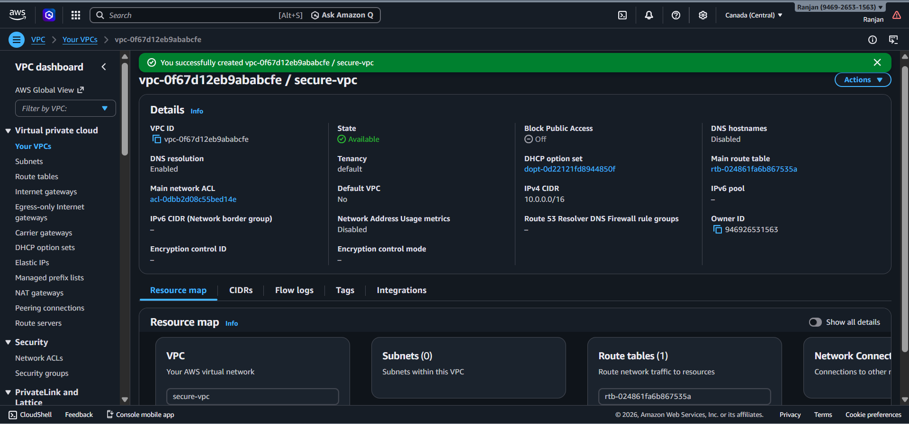
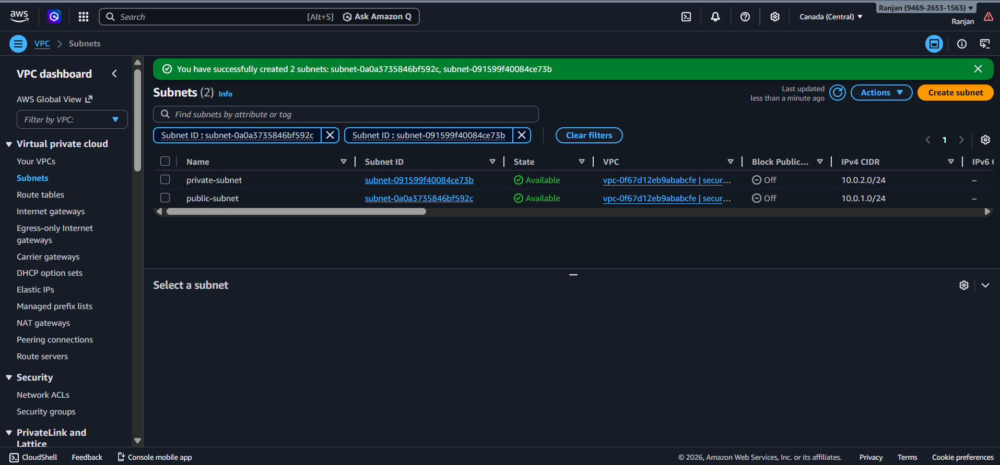
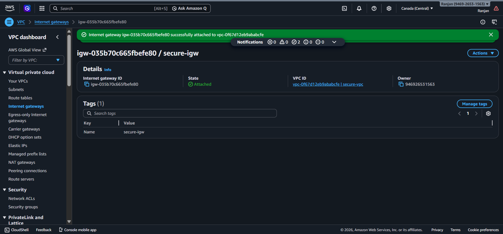

---

### 🛣️ Routing Configuration
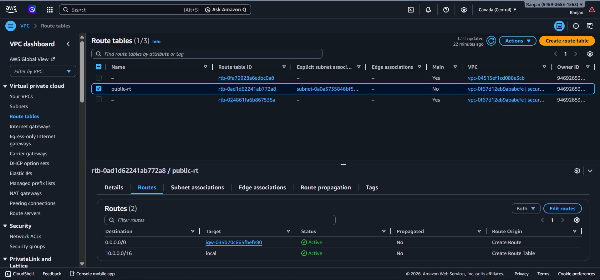
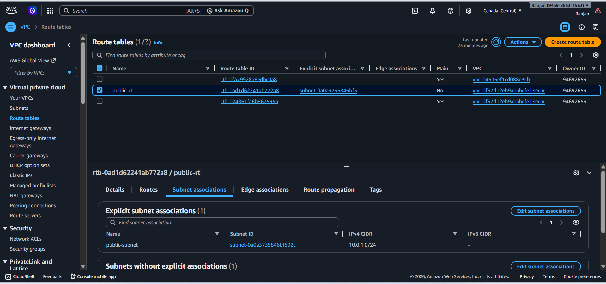

---

### 🔐 Security Setup
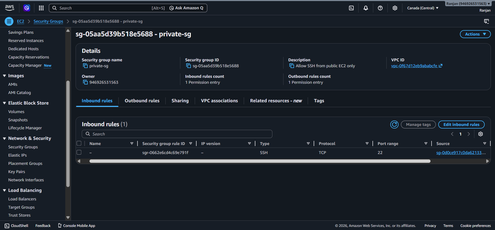
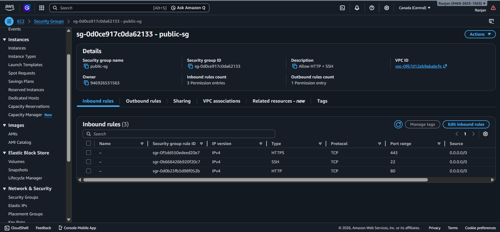

---

### 🚀 EC2 Deployment
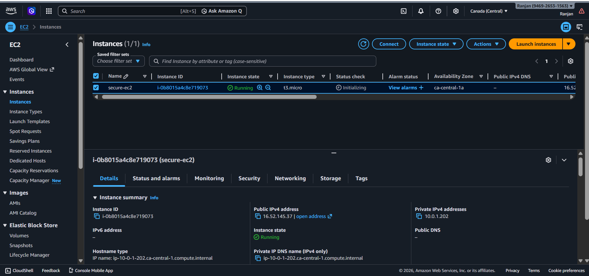
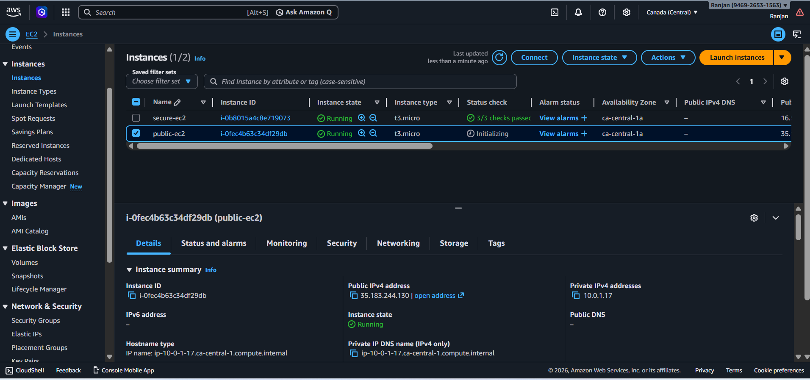
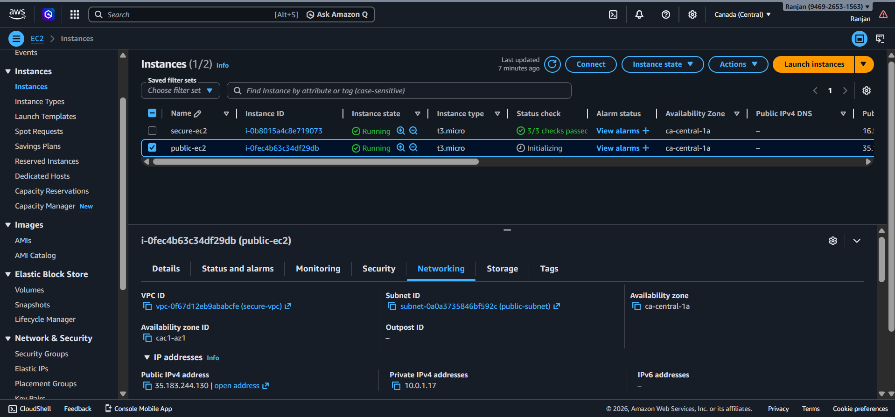

---

### 🔗 Secure Access (Bastion Host)
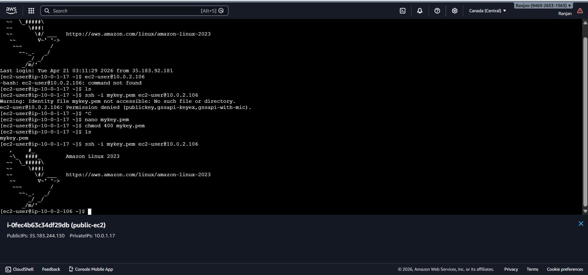
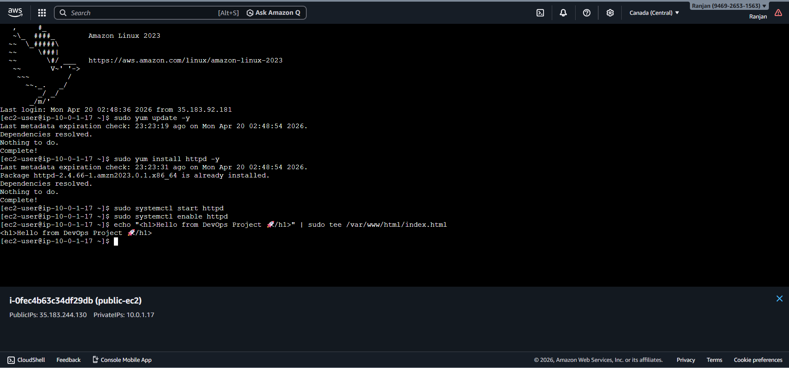

---

### 🧠 Architecture Proof
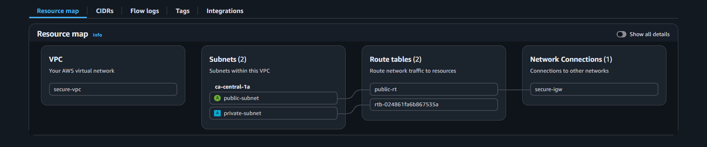
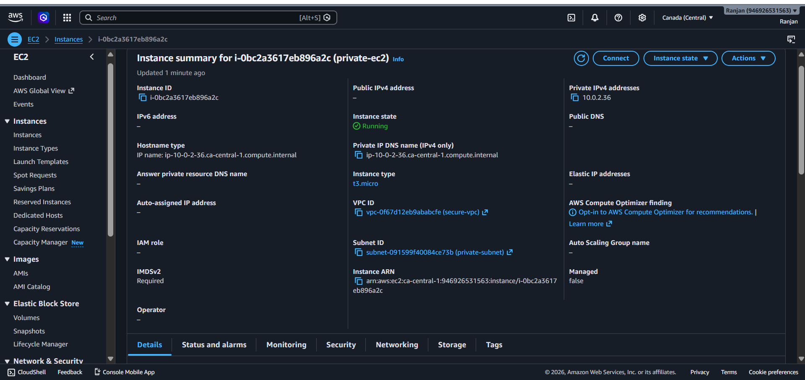

---

### ✅ Final Output
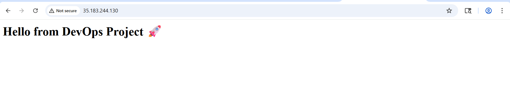

---

## 🔐 Key Features
- No direct internet access to private EC2
- Secure SSH access via Bastion Host
- Network isolation using VPC
- Controlled access using Security Groups

---

## 📚 Learning Outcomes
- Understood VPC and subnet design
- Implemented secure architecture using Bastion Host
- Learned EC2 networking and SSH access
- Applied real-world cloud security practices

---

## 📌 Future Improvements
- Add NAT Gateway for outbound internet access
- Deploy application on private EC2
- Integrate CloudWatch monitoring
- Implement IAM roles for better security

---

## 👨‍💻 Author
**Ranjan Kumar Upadhyay**
